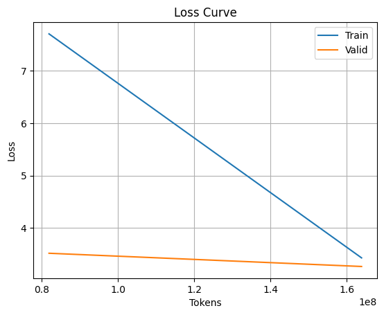

# 🧠 Tiny Stories Language Model Training

This project trains a lightweight autoregressive language model (GPT-like) on a dataset of children's stories. The training is performed using PyTorch on an NVIDIA GeForce RTX 3090 GPU.

---

## 📊 1. Training Configuration

| Parameter          | Value         |
|--------------------|---------------|
| Model Type         | GPT-style     |
| Vocabulary Size    | 10,000        |
| Context Length     | 128 tokens    |
| Embedding Size     | 256           |
| Layers             | 8             |
| Attention Heads    | 16            |
| Batch Size         | 32            |
| Epochs             | 2             |
| Steps per Epoch    | 20,000        |
| Total Tokens Seen  | 1.6 × 10⁸     |

Model is trained for **2 epochs**, each with **20,000 steps**, on batches of 32 sequences of 128 tokens:


Total Tokens = epochs × steps\_per\_epoch × batch\_size × context\_length
\= 2 × 20000 × 32 × 128 = 163,840,000 tokens


---

## 📈 2. Training and Validation Performance

The figure below shows the training and validation loss across epochs:



| Epoch | Train Loss | Train PPL | Valid Loss | Valid PPL |
|-------|------------|-----------|------------|-----------|
| 1     | 7.7049     | 2219.13   | 3.5197     | 33.78     |
| 2     | 3.4318     | 30.93     | 3.2674     | 26.24     |

> ✨ Training shows strong convergence with significant reduction in perplexity after the first epoch.

---

## 📄 3. Sample Outputs

After each epoch, the model generates short texts using top-k sampling:

**Epoch 1 Output:**
```

"Spot saw the shiny car and said, 'Wow, Kitty, your car is so bright and clean!' Kitty smiled and replied, 'Thank you, Spot. I polish it every day.'"

```

**Epoch 2 Output:**
```

"Once upon a time, in a big forest, there lived a rhinoceros named Roxy. Roxy loved to climb... She found a big, red ball!"

```

> 🐣 The generated samples become more coherent and imaginative as training progresses.

---

## 📌 Notes

- Model uses `torch._native_multi_head_attention` backend.
- Training and evaluation take ~23 minutes per epoch.
- The code can be extended for longer training, fine-tuning, or downstream tasks.

---

## 🖼 Attachments

- [`plot.png`](./plot.png): Training and validation loss over epochs.
- [`model_checkpoint.ckpt`](./model_checkpoint.zip): Saved model checkpoint
```
